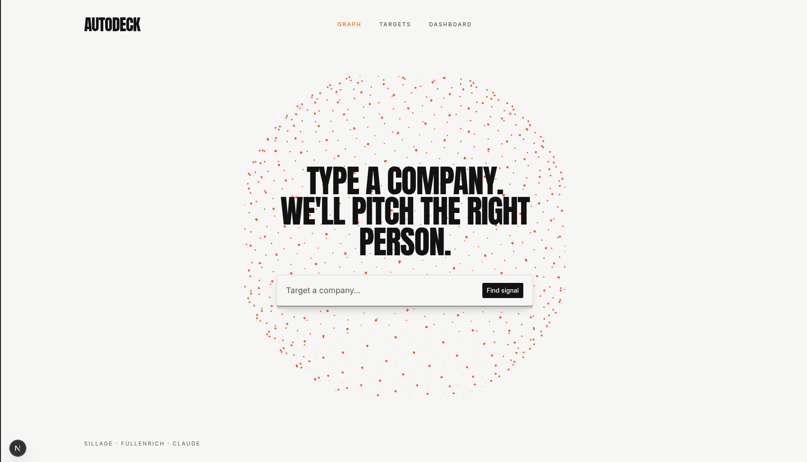

# AutoDeck

**The GTM autopilot.** Type a company → AutoDeck finds the moment and the right person, then puts a personalized video pitch deck in their inbox — and pings you the second they hit play.

An intent signal (**Sillage**) → the right person, picked and pitched (**Claude** + **FullEnrich**) → a narrated video deck (**Gamma** + **Gradium** cloned voice + avatar) → in the prospect's inbox (**Resend**) → a live *"your prospect is watching"* cha-ching.

Built in one day at the **Agentic GTM Hackathon** (Station F, Paris — 2026-07-09), with [Mathis Villaret](https://github.com/Mathis-14).



---

## What it does

AutoDeck isn't a deck generator — it's an **autopilot**: a pipeline that makes itself. You give it a company name; it does the rest of the top of the funnel.

1. **Target.** Type a company on the landing graph.
2. **Signal + people.** Sillage surfaces the intent signals and the org; the people condense onto a 3D constellation, one node at a time.
3. **Pick.** Claude ranks the org, picks the single best contact, and writes the outreach angle. That node ignites orange; the rest dim.
4. **Enrich.** FullEnrich verifies the pick's email + mobile.
5. **Pitch.** A pre-baked video deck (Gamma slides, cloned-voice narration, avatar) is sent as a link.
6. **Cha-ching.** The moment the prospect presses play, the dashboard fires a loud notification with live watch-time.

The 3D people graph is the visual centerpiece — a people-only org constellation where seniority sizes each node and Claude's pick lights up progressively.

## The pipeline

```
[Company name]  →  /api/prospect
   ├─ Sillage       getSignals(company) · getPeople(company)      → intent + org
   ├─ Claude        rank → pick the best contact → write the angle (structured output)
   └─ FullEnrich    enrich the pick → verified email + mobile
        → the graph animates the run progressively

[Click a contact]  →  queue a pitch  ·  or open the reach-out page (/reachout/[id])

[Generate]  (offline / pre-baked)
   Gamma deck → PNG slides → Gradium TTS (cloned voice) → ffmpeg assemble
   → fal.ai talking-head avatar (PIP) → public/videos/{id}.mp4

[Send]   → Resend: personal note + thumbnail linking to /v/{id}
[Watch]  → /v/{id} share page → tracking → dashboard cha-ching + live watch-time
```

## Stack

| Layer | Choice |
| --- | --- |
| App | Next.js 16 (App Router) · React 19 · TypeScript strict · Tailwind v4 |
| Graph | Vanilla **Three.js** behind a data-only props interface (renderer stays swappable) |
| LLM | AI SDK (`ai` + `@ai-sdk/anthropic`), `claude-sonnet-5`, structured outputs |
| Signals / people | **Sillage** (MCP or v2 API) |
| Enrichment | **FullEnrich** v2 |
| Slides · Voice · Avatar | **Gamma** · **Gradium** (cloned voice) · **fal.ai** |
| Email · Notify | **Resend** · SSE |
| State | In-memory + JSON files — no DB |

Design system: editorial / risograph — off-white `#F7F7F5`, near-black `#111111`, one orange accent `#FF6500`.

## Run

```bash
npm install
cp .env.example .env.local   # fill in keys — every adapter falls back to a mock without them
npm run dev                  # http://localhost:3000
```

**Mocks-first:** with no keys set, every adapter runs a realistic deterministic mock, so the whole app runs and demos end-to-end offline. Drop real keys into `.env.local` one at a time to light up each partner.

```bash
npx tsc --noEmit     # typecheck (must pass before every commit)
npm run lint         # eslint 9
npm run build        # production build
npx tsx scripts/smoke.ts   # the demo-path smoke run
```

## Project structure

```
app/            routes + API (thin wiring); /api/prospect, /reachout/[id], /v/[id], /dashboard, /targets
components/     UI — components/graph/ = the Three.js constellation; components/ui/ = shadcn
lib/            adapters + Claude steps + demo-run (the staged story) + jury cache
engine/         standalone video pipeline: slides, tts, assemble, avatar (run via npx tsx)
scripts/        smoke.ts + the jury-cache builder
data/ · public/videos/   per-prospect JSON, slides, rendered videos (git-ignored)
assets/         README media
```

## Docs

- **`AGENTS.md`** — the single source of truth: architecture, team-lane contract, exact partner-API facts, quality rules, and the append-only decision log. **Read it before changing anything.**
- **`GRAPH-GUIDE.md`** — how the people constellation and its nodes work (handover doc).
